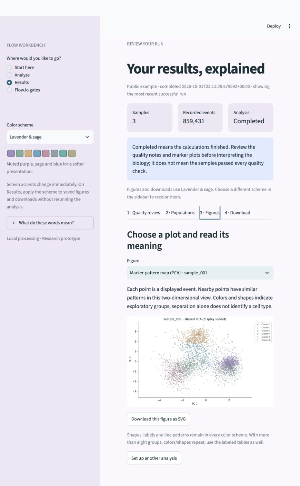

# Flow Workbench

**A local flow cytometry analysis app with a guided interface and a reproducible command-line workflow.**

Flow Workbench helps colleagues inspect FCS files, review acquisition quality, apply reviewed gates, explore marker patterns, and export reports. The Streamlit interface and CLI use the same Python analysis engine. This project is maintained in **[Lubna-Younas/FlowRepository-](https://github.com/Lubna-Younas/FlowRepository-)**.

> **Status: research prototype, version 0.2.0.** The app runs locally and has been exercised with public conventional-flow examples and synthetic stress tests. Aurora/S8 lab validation is pending. Automatic biological cell-type identification, raw spectral unmixing, batch normalization, and native S8 FCS 3.2 support are not implemented.



[Quick start](#quick-start) · [Workflow](#the-analysis-workflow) · [Supported data](#supported-data-and-instruments) · [Examples and tests](#example-data-and-tests) · [CLI](#command-line-analysis) · [Documentation](#documentation) · [Contributing](CONTRIBUTING.md)

## Quick start

Use **Python 3.12** for the closest match to the tested environment. Installation requires internet access and compatible dependency wheels. The package declares Python 3.11–3.14 support, but those combinations and all operating systems have not yet been validated. The existing verification was performed on macOS Intel with Python 3.12.

### 1. Get the project

Clone the repository, or choose **Code → Download ZIP** on GitHub and extract it. Access to the repository is required if it is private.

```bash
git clone https://github.com/Lubna-Younas/FlowRepository-.git
cd FlowRepository-
```

Run the following commands from the extracted/cloned project folder.

### 2. Launch the app

**macOS / Linux**

```bash
python3.12 launch.py
```

**Windows (PowerShell)**

```powershell
py -3.12 launch.py
```

The launcher creates a project-local `.venv` and installs the app on first use. It then starts the local server. This is a Python source launcher; signed standalone desktop installers are planned.

Open **[http://127.0.0.1:8501](http://127.0.0.1:8501)**. Keep the terminal running while using the app; **Ctrl+C** stops it. Relaunch after stopping it or restarting the workstation. Refreshing a browser tab cannot restart a stopped server.

### 3. Try the public example, or upload your files

For your own files, choose **Start here → Use my own FCS files**.

For the built-in example, first download the pinned public fixtures in another terminal opened in the project folder. Downloads use only Python's standard library:

```bash
python3.12 scripts/download_data.py
```

On Windows use `py -3.12 scripts/download_data.py`. Then choose **Start here → Try the example**, keep the selected CD3/CD4/CD8 markers, and click **Run example analysis**. The three example files contain **859,431 recorded events**. They are conventional-flow demonstration files, not Aurora/S8 validation data.

The [illustrated beginner guide](docs/quick-start.md) explains each control and plot.

## The analysis workflow

**Choose files → confirm export state and markers → run → review quality → inspect populations and figures → download.**

| Page | What to do |
|---|---|
| **Start here** | Choose the example or your own FCS files; read how this app fits with FlowJo. |
| **Analyze** | Upload files from one compatible panel, confirm their processing state, select markers, and optionally enable clustering or supply reviewed gates. |
| **Results** | Work through **Quality review**, **Populations**, **Figures**, and **Download**. |
| **FlowJo gates** | Supply a `.wsp` and its matching original FCS files to reconstruct supported workspace gates in a separate workflow. |

**The Run button depends on your choice:**

- **Example data** → **Run example analysis**.
- **My FCS files** → **Run analysis**. The button is visible but disabled until the required inputs are ready. The checklist explains missing export status, missing markers, empty files, or invalid settings.

An **event** is a recorded measurement, not necessarily a live cell. A **cluster** is a provisional group of similar marker signals, not a confirmed cell type. **Eligible** events have passed the implemented numeric/gate criteria; without cleanup gates, they may still include debris, dead cells, or doublets. **Completed** means calculations finished; it does not mean all samples passed quality review.

Experimental design, controls, marker selection, biological interpretation, and the validity of a gating strategy still require scientific review. The app cannot reconstruct missing controls after acquisition.

## Supported data and instruments

| Input | Current handling |
|---|---|
| **FCS 2.0 / 3.0 / 3.1** | Strict parsing and metadata inspection. Malformed offsets are reported rather than silently repaired. |
| **Raw conventional fluorescence** | Applies a supplied FCS spillover matrix once, after an explicit processing-state declaration. |
| **Already compensated / unmixed** | Preserves that processing state; does not apply compensation again. |
| **Already transformed** | Requires `transform: none` to prevent a second transformation. |
| **Cytek Aurora** | Intended entry point is a verified unmixed export; actual lab-panel validation is pending. |
| **BD FACSDiscover S8** | Native **FCS 3.2 is blocked**. A separately validated reader or numerically verified supported export is needed. Do not rename the FCS version header. |
| **Raw spectral / imaging parameters** | No spectral unmixing or imaging-analysis module. Do not combine raw detectors, unmixed signals, and imaging channels in marker clustering. |
| **FlowJo workspaces** | Partial FlowJo v10 reconstruction through FlowKit. FlowJo v11 and S8 spectral matrix handling are unvalidated. |

Processing state must come from acquisition/export provenance. A filename or the presence of a matrix is not sufficient evidence. Negative values after compensation/unmixing can be valid and are retained.

Default prototype limits are **200 MiB per FCS**, **1,000,000 events per file**, and **2,000,000 events per run**. These are configured limits, not measured workstation capacity guarantees.

## What is implemented

| Stage | Available now |
|---|---|
| Import and QC | FCS metadata checks, nonfinite-event accounting, acquisition-bin signal/rate flags, low-event and range warnings. Flagged acquisition intervals are retained for review. |
| Gates and transformation | Expert-reviewed rectangular/polygon gate hierarchy; arcsinh, logicle, or no transformation; original event indices preserved. |
| Population exploration | Optional shared MiniBatchKMeans baseline and shared PCA plots. Fits on a bounded subset; assignments/counts use all eligible events. |
| Cross-sample summaries | Group frequencies and transformed marker medians for compatible panels. Cluster IDs are consistent within one run. |
| Statistics | Exact event-counting intervals and limited exploratory independent-subject, two-group tests with sample metadata and multiple-testing correction. Unsupported designs remain descriptive. |
| Reporting | HTML report, editable SVG/PDF figures, CSV summaries, gzipped event assignments, settings, checksums, package versions, and fit/plot indices. |
| Appearance | Five schemes; existing reports can be recolored without refitting clusters or changing analysis tables. |

**Not yet implemented:** automatic cell-type annotation, universal debris/singlet/live gating, graphical gate drawing, PeacoQC, FlowSOM, CytoNorm, UMAP, batch normalization, paired/mixed-effects inference, native S8 support, and production multi-user hosting.

### Few populations, rare cells, and few samples

- **Few populations:** disable clustering or select a suitable exploratory group count. A chosen value of six does not establish six cell types.
- **Rare cells:** final counts use all eligible events, but the fitting subset can miss rare populations. Use reviewed gates and controls for targeted rare-cell analysis. Zero observed events do not prove absence; count warnings are not validated detection limits.
- **Few biological samples:** many events from one tube do not create independent biological replicates. Counting intervals do not describe donor variation. Unsupported small-sample, paired, or multi-batch comparisons remain descriptive.

See [QC and edge cases](docs/qc-and-edge-cases.md) and the [validation plan](docs/validation-plan.md).

## Colors and accessibility

Select **Color scheme** in the sidebar:

| Scheme | Configuration value |
|---|---|
| Soft pastels | `soft` |
| Ocean & sand | `ocean` |
| Lavender & sage | `lavender` |
| Colorblind contrast (Okabe–Ito) | `accessible` |
| Grayscale / print | `grayscale` |

On an existing result, click **Apply selected colors to this report**, then download the updated ZIP. Recoloring preserves counts, assignments, and analysis tables. Shapes, labels, line styles, and hatching provide additional cues. Colors/shapes repeat above eight groups. Custom pastel palettes are not guaranteed to work for every form of color-vision deficiency; full simulation/user testing remains pending.

## Example data and tests

Raw datasets and trained models are **not included in the repository**. The public catalog pins upstream commits and verifies file sizes and Git blob digests; downloads receive SHA-256 receipts.

```bash
python3.12 scripts/download_data.py
.venv/bin/python scripts/make_synthetic_data.py
.venv/bin/python -m pip install -e ".[dev]"
.venv/bin/python -m pytest -q
```

On Windows, replace `.venv/bin/python` with `.venv\Scripts\python.exe` and use `py -3.12` for the downloader. The optional development install supplies pytest.

- **Public fixtures:** 28 files, including 17 FCS, from three upstream repositories; approximately 80.12 MiB. These are test fixtures, not 28 independent cohorts or donors.
- **Synthetic fixtures:** two populations, one population, 0.1% rare events, very low event counts, acquisition drift/nonfinite values, and an intentionally empty file.
- **Empty-file test:** `zero_events.fcs` must be rejected. To analyze the other synthetic files in the GUI, remove the empty file from the upload selection and click **Use synthetic test settings**. The original file is not deleted.
- **Training harness:** a subject-disjoint Random Forest benchmark has been exercised on synthetic data only. No validated cell-type model is deployed in the app. More unrelated datasets do not automatically improve a panel-specific model.

The last local verification passed **19 tests** with public fixtures present. Without downloaded public fixtures, the public-example UI test is skipped. See the [verification record](docs/verification.md) for exact scope and open discrepancies.

A GitHub Actions workflow is supplied for Python 3.12 on Linux, Windows and macOS. It is a test configuration, not evidence that those platforms have passed. Public-data checks are optional through manual workflow dispatch. See [Contributing](CONTRIBUTING.md).

## Command-line analysis

The launcher supports the same engine used by the GUI. The following examples use Bash filename expansion and assume the public fixtures have been downloaded.

```bash
python3.12 launch.py inspect data/raw/flowkit/data/8_color_data_set/fcs_files/*.fcs

python3.12 launch.py run data/raw/flowkit/data/8_color_data_set/fcs_files/*.fcs \
  --config configs/public_8color.yaml \
  --output reports/my_public_run
```

The saved CLI configuration uses **seven markers**; the beginner GUI preset uses **three**. Both use the same three FCS files, but their clustering results need not match. Output directories must be new or empty.

PowerShell example:

```powershell
$fcsFiles = (Get-ChildItem data/raw/flowkit/data/8_color_data_set/fcs_files/*.fcs).FullName
py -3.12 launch.py run @fcsFiles --config configs/public_8color.yaml --output reports/my_public_run
```

Use [configs/aurora_unmixed.yaml](configs/aurora_unmixed.yaml), [configs/s8_unmixed.yaml](configs/s8_unmixed.yaml), or [configs/synthetic.yaml](configs/synthetic.yaml) as starting points. Spectral templates deliberately contain no invented panel markers or gate thresholds. Replace placeholders with verified panel-specific settings. Add `--sample-sheet configs/sample_sheet_template.csv` only after filling in the actual sample/subject/condition/batch metadata.

### Work with existing FlowJo gates

```bash
python3.12 launch.py flowjo data/raw/flowkit/data/8_color_data_set/8_color_ICS.wsp \
  --fcs-dir data/raw/flowkit/data/8_color_data_set/fcs_files \
  --output reports/my_flowjo_import
```

A workspace describes gates and settings; matching original FCS files supply the events. Importing a workspace does not automatically apply its gates to the exploratory Analyze workflow. Compare reconstruction with native FlowJo counts, denominators, transforms, compensation, and event membership. The bundled mouse fixture has an unresolved **five-event CD4 membership discrepancy**; full FlowJo equivalence is not claimed.

## Outputs and local data handling

Download the complete report ZIP, extract it, and open `report.html`. Keep its folders together:

```text
report.html          Readable report and links to figures/tables
summary.json         Run status, executed stages and review notes
figures/             Editable SVG and PDF plots
tables/              Event counts, frequencies, QC and marker summaries
events/              Original event indices, flags and assignments
metadata/            Configuration, provenance, hashes and display subsets
```

The app processes cytometry data on the local workstation. Its server binds to `127.0.0.1` and Streamlit usage statistics are disabled. Uploads are copied into temporary working directories. GUI results are held in session memory: **download them before closing or restarting the app**. CLI outputs persist in the specified output directory.

Hosted authentication, user isolation, durable job history, secure deletion, and institutional retention controls are not implemented. Do not expose the prototype as an institutional shared service without implementing those requirements.

## Repository layout

```text
src/flowworkbench/    Analysis engine, CLI, GUI, reporting and palettes
configs/             Explicit analysis presets and sample-sheet template
scripts/             Downloads, synthetic fixtures, audits and training harness
tests/               Engine and interface regression tests
data/catalog/        Pinned public download catalog and expansion status
docs/                Walkthrough, design, QC, validation and provenance
benchmarks/          Small public-fixture audit and agreement summaries
.github/             Automated tests and contribution templates
launch.py            Project-local environment and app launcher
pyproject.toml       Package metadata and dependencies
```

`.gitignore` excludes raw FCS/workspace files, local uploads, environments, logs, generated reports and trained models. Keep sample identifiers and study data out of commits and public issue reports.

## Troubleshooting

| Problem | Next step |
|---|---|
| Browser says the site cannot be reached | Run the launcher again and keep its terminal open; then reload `http://127.0.0.1:8501`. |
| “Run example analysis” is missing | It appears only in Example data mode. Uploaded files use **Run analysis**. |
| “Run analysis” is disabled | Read the checklist directly above it: upload readable nonempty files, confirm export state, select markers, and fix settings errors. |
| Example data are missing | Run `scripts/download_data.py` from the project folder, then return to the example. |
| Native S8 FCS 3.2 or malformed offsets | The reader blocks unsupported/inconsistent files. Preserve the original; use a validated conversion/reader workflow, not a renamed header or ignored error. |
| Empty `zero_events.fcs` | This intentionally tests rejection. Remove it from the current upload selection for a successful synthetic run. |
| Address already in use | An app may already be running on port 8501. Open its URL instead of starting another instance. |
| Dependency installation fails | Use Python 3.12, a fresh project environment, and the exact error when reporting the issue. Platform compatibility remains under validation. |

## Documentation

- [Beginner walkthrough](docs/quick-start.md)
- [Design, scientific requirements and roadmap](docs/project-design.md)
- [QC and small/rare/poor-quality data](docs/qc-and-edge-cases.md)
- [Validation and model-training plan](docs/validation-plan.md)
- [Dataset provenance and download status](docs/datasets.md)
- [Executed checks and known limitations](docs/verification.md)
- [Change history](CHANGELOG.md)
- [Contributing and development](CONTRIBUTING.md)

## Roadmap

1. Validate actual Aurora/S8 exports and resolve parser/FlowJo discrepancies.
2. Establish one panel with reviewed controls, gates, and independent expert labels.
3. Integrate established QC, population-discovery and reference-normalization modules.
4. Evaluate panel-compatible models with subject/batch/site holdouts and unknown-population handling.
5. Validate workstation resources and clean installations before signed desktop packaging.

## Attribution and licensing

Core dependencies include [FlowKit](https://github.com/whitews/FlowKit), [Streamlit](https://github.com/streamlit/streamlit), [scikit-learn](https://github.com/scikit-learn/scikit-learn), and [Matplotlib](https://github.com/matplotlib/matplotlib). Public fixture sources and their limitations are documented in [the dataset register](docs/datasets.md).

A project software license has not yet been selected for the locally prepared source. Do not assume a license from a dependency or dataset repository. The maintainer should preserve any existing repository license and explicitly select terms before an external software release. Third-party datasets retain their own applicable terms.
