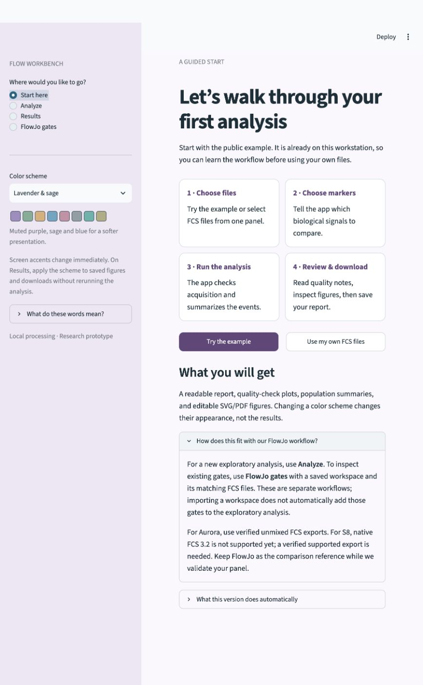

# Your first analysis in Flow Workbench

The app has four pages in the left sidebar: **Start here**, **Analyze**, **Results**, and **FlowJo gates**. Think of the main workflow as **choose files → confirm export/markers → run → review → download**.

## Try it with the public example

1. Open **http://127.0.0.1:8501/**. If the app is closed, run `python3 launch.py` from the project folder and keep that terminal open.
2. Choose **Start here → Try the example**. No upload is needed on this workstation. The three public example files contain **859,431 recorded events** in total; these are conventional-flow demonstration files, not your Aurora/S8 lab samples.
3. On **Analyze**, leave **Example data** selected. The file table shows each file's recorded events and number of measured channels.
4. Keep **CD3, CD4 and CD8** selected. Leave **Explore groups of similar events (clustering)** checked with **6** exploratory groups for this demonstration. Six is an illustrative setting, not a discovered number of cell types. Leave **Advanced settings** closed.
5. Press **Run example analysis**. The app opens **Results** when calculations finish.
6. Read the four result tabs in order, using the table below. “Completed” means the calculation finished; it does not certify sample quality.
7. On **4 · Download**, press **Download complete report (ZIP)**. Unzip it, open `report.html`, and keep the extracted folders together. Save this before closing the session; the app does not maintain a permanent run history.

| Result tab | What to look at | What it means |
|---|---|---|
| **1 · Quality review** | Recorded, Eligible, Flagged for review, and the quality notes | Recorded is everything measured. Eligible excludes invalid-number events and respects supplied gates. Flagged intervals remain in the analysis and need inspection. With no cleanup gates, eligible events may still include debris, dead cells and doublets. |
| **2 · Populations** | Events in group, Events in parent, Percent of parent, and low-count flags | Percentages depend on the parent denominator. “Cluster 1” is a provisional group of similar signals, not a confirmed cell type. Counting intervals do not measure donor-to-donor variation. |
| **3 · Figures** | Choose a plot in the Figure menu and read the explanation above it | PCA displays marker patterns; acquisition plots show signal/rate changes; marker distributions show signal ranges; the heatmap compares group frequencies. |
| **4 · Download** | Complete ZIP and exact settings | Includes the report, SVG/PDF figures, CSV summaries, original event numbers with assignments, settings and provenance. |

## Choose your colors

Use **Color scheme** in the left sidebar. Five choices are available:

| Display name | Suitable use | Configuration key |
|---|---|---|
| Soft pastels | Gentle default appearance | `soft` |
| Ocean & sand | Muted blue, teal and warm tones | `ocean` |
| Lavender & sage | Muted purple and green tones | `lavender` |
| Colorblind contrast (Okabe–Ito) | Clearer color separation; recommended accessibility option | `accessible` |
| Grayscale / print | Monochrome viewing or printing | `grayscale` |

Screen accents change immediately. A new analysis uses the selected scheme. For a completed analysis, go to **Results → Apply selected colors to this report**. This redraws the figures and updates the report download without refitting groups or changing counts, event assignments, statistical tables, or recorded QC decisions. Download the ZIP again to obtain the recolored version.

Different point shapes, line styles, labels and hatching provide additional cues. Above eight groups, colors and point shapes repeat; consult the labeled tables. Custom pastel palettes are not guaranteed to be distinguishable for every form of color-vision deficiency. The contrast preset uses the [Okabe–Ito color-universal-design palette](https://jfly.uni-koeln.de/color/). Heatmaps use sequential maps following [Matplotlib's colormap guidance](https://matplotlib.org/stable/users/explain/colors/colormaps.html). Full color-vision simulation and user testing remain pending.

For the CLI, add a configuration entry such as `palette: lavender`. Reports made before version 0.2 have no saved display arrays; run those once in the updated app before using its recoloring feature. The current interface recolors the latest report in the current session, not arbitrary uploaded ZIP archives.

## Then use your lab files

**Which Run button should I see?** `Example data` uses **Run example analysis**. `My FCS files` uses **Run analysis**. The button stays visible and disabled until the required inputs are ready; the checklist immediately above it explains what is missing. Upload readable, nonempty files, confirm their export status, and select markers. Correct file or settings errors before running. No uploaded files are skipped automatically.

**Trying the generated synthetic fixtures?** Their metadata identifies them as software test data. Click **Use synthetic test settings** to choose Synthetic test data, MarkerA and MarkerB, and two exploratory groups. Remove `zero_events.fcs` from the upload selection using its Remove control: it is an intentionally empty rejection test, not an analyzable sample. Removing it from this selection does not delete the original file. The other stress fixtures can produce quality warnings that should be reviewed. Do not use this synthetic preset for real Aurora/S8 measurements.

1. Choose **Start here → Use my own FCS files** and select samples from one compatible marker panel. Keep control tubes separate from biological sample comparisons.
2. Select the instrument and confirm **How were these files exported?** with the operator. For Aurora, the starting point is a verified **already unmixed** export. Unmixing means the spectral software has separated the fluorescence signals. The app does not perform raw spectral unmixing. S8 native FCS 3.2 is currently rejected; it needs a validated reader or a verified supported export before this prototype can analyze it.
3. Select phenotype markers appropriate for the biological question. Avoid adding Time, scatter, imaging channels or viability to exploratory marker clustering. Viability/singlet/cleanup gates are separate analysis steps.
4. Decide whether you want exploratory clustering. For few expected populations, do not assume the default six is appropriate. An expert-reviewed gating strategy may be more useful; the current GUI accepts gate definitions in advanced settings but does not yet offer graphical gate drawing.
5. Run, review acquisition quality, then inspect the groups against your panel and your FlowJo reference. No trained automatic cell-type annotation or cross-batch normalization is implemented yet.

**Rare populations:** final counts use all eligible events, but clustering is fitted on a subset and may miss a rare group. A zero count does not establish biological absence. Use reviewed gates and appropriate controls when targeting rare cells.

**Few biological samples:** many events from one tube do not equal many independent donors. Optional sample metadata belongs under Advanced settings. Unsupported small-sample, paired or multi-batch comparisons remain descriptive; the app will not manufacture inferential support from event counts.

## Where FlowJo fits

Choose **FlowJo gates** only when you already have a saved `.wsp` and the matching original FCS files. Upload both and press **Reconstruct supported gates**. The workspace contains the gating instructions; the original FCS files contain the events. This separate route exports supported gate counts and membership. It does not automatically transfer those gates to Analyze.

Support is partial and aimed at FlowJo v10 workspaces. Always compare the reconstructed results with FlowJo. FlowJo v11 and S8 spectral matrix handling have not been validated in this prototype.

## Helpful vocabulary

- **Event:** one recorded measurement; not necessarily one live cell.
- **Marker:** a biological signal such as CD3, CD4 or CD8.
- **Gate:** a selection rule, like a gate in FlowJo.
- **Parent:** the population from which a subgroup is counted.
- **Cluster:** a provisional group of events with similar selected marker signals.
- **QC:** quality checks on files and acquisition.
- **Transformation:** rescaling signal values to analyze and display them; not batch normalization.

The sidebar's **What do these words mean?** section provides a short reminder while you work.
